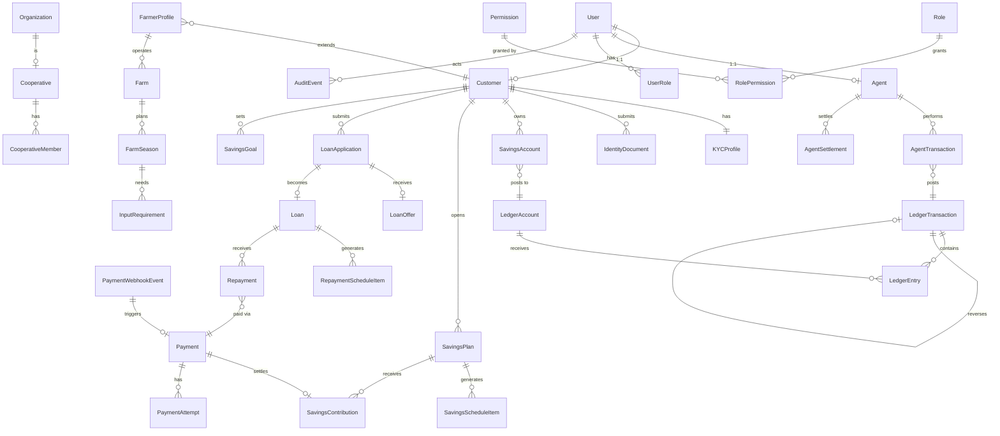

# RFUND — Domain Model (Phase 0)

Monetary values: `DecimalField(max_digits=19, decimal_places=2)` with explicit `currency` (ISO-4217, `NGN` initial). All money arithmetic uses Python `Decimal` — never float. UUID primary keys everywhere; separate human-readable references (`RF-SAV-20260921-000001`) for public identification. UTC internally, `Africa/Lagos` for display.

## Entity overview

### accounts (identity & access)
- **User** — phone (unique), email (unique, optional), password (Argon2), status, `is_active`. Authentication identity only; never carries financial data.
- **Role** — code (CUSTOMER, AGENT, AGENT_SUPERVISOR, FIELD_OFFICER, LOAN_OFFICER, KYC_OFFICER, RISK_OFFICER, FINANCE_OFFICER, SUPPORT_AGENT, COOPERATIVE_ADMIN, REGIONAL_MANAGER, ADMIN, SUPER_ADMIN), description.
- **Permission** — code (`loan.approve`, `ledger.reverse`, …), description.
- **RolePermission** — grants a permission to a role.
- **UserRole** — user ↔ role assignment (audited).
- **AuthToken** — opaque token (SHA-256 hash at rest), user, kind (ACCESS/REFRESH), expires_at, revoked_at, device metadata, predecessor (rotation chain).
- **OTPCode** — purpose (SIGNUP/LOGIN/STEP_UP/PASSWORD_RESET/PHONE_CHANGE), hashed code, phone, expires, attempts, consumed.
- **LoginAttempt** — phone, IP, result; throttling evidence.

### customers
- **Customer** — user (1:1), customer_reference (unique), names, phone, email, DOB, gender, occupation, address (state/lga/community), preferred_language, status (ACTIVE/SUSPENDED/DEACTIVATED), kyc_tier.

### identity (KYC)
- **KYCProfile** — customer 1:1, status (NOT_STARTED/PENDING/UNDER_REVIEW/VERIFIED/REJECTED/EXPIRED), level (BASIC/STANDARD/ENHANCED), provider references.
- **IdentityDocument** — customer, type (NIN/BVN/PASSPORT/DRIVERS_LICENSE/VOTERS_CARD/OTHER), number (encrypted at rest), storage key, expiry.
- **KYCVerification** — customer/document, provider, provider reference, result, payload (JSON).
- **KYCReview** — reviewer, decision, reason, before/after status.

### ledger (the core)
- **LedgerAccount** — code (unique), name, type (ASSET/LIABILITY/EQUITY/INCOME/EXPENSE), currency, status, `balance` (projection), `last_posted_at`. Rows locked on posting.
- **LedgerTransaction** — reference (unique), transaction_type, status (DRAFT/VALIDATING/POSTED/REJECTED), currency, description, external_reference, idempotency_key (unique), created_by, posted_at, `reversal_of` (self FK), `reversed_by`.
- **LedgerEntry** — transaction FK, account FK, direction (DEBIT/CREDIT), amount, currency, metadata (JSON). Immutable once posted.
- **AccountingPeriod** — name, start, end, status (OPEN/CLOSED).
- **BalanceSnapshot** — account, as_of, balance, entry counts (audit evidence).
- **LedgerBatch** — bulk posting grouping (migration/period ops).

### payments
- **Payment** — reference, customer, purpose (SAVINGS_CONTRIBUTION/GOAL_FUNDING/LOAN_REPAYMENT/ACCOUNT_FUNDING), amount, currency, status (INITIALIZED/PENDING/SUCCESS/FAILED/CANCELLED/REVERSED/REFUNDED), provider, provider_reference, idempotency_key, metadata (target plan/goal/loan).
- **PaymentAttempt** — payment, provider, provider_reference, amount, status, raw response.
- **PaymentWebhookEvent** — provider, event_id (unique), event_type, payload (JSON), signature_valid, received_at, processed_at, processing_status, error.
- **PaymentProviderEvent** — normalized provider transaction mirror used by reconciliation.
- **VirtualAccount** — provider, provider_reference, customer, account_number, bank, status (architecture for dedicated virtual accounts).

### savings
- **SavingsProduct** — code, name, description, min/max contribution, allowed frequencies, payout policy, status. **SavingsProductVersion** — versioned configuration snapshot (§94).
- **SavingsAccount** — customer, product, ledger account link, status.
- **SavingsPlan** — reference, customer, product+version, amount, frequency (DAILY/WEEKLY/MONTHLY/QUARTERLY/BIYEARLY/YEARLY), start/end dates, status (DRAFT/ACTIVE/COMPLETED/CANCELLED/PAUSED), payout_policy.
- **SavingsScheduleItem** — plan, due_date, amount, status (UPCOMING/DUE/PAID/MISSED/WAIVED/CANCELLED), paid_at, payment reference.
- **SavingsContribution** — plan, payment, ledger transaction, amount, posted_at.
- **SavingsPayout** — plan, request, amount, status, ledger transaction.
- **SavingsGoal** — customer, name, target amount, current amount (projection), target date, frequency, contribution amount, status.

### loans
- **LoanProduct** — code, name, min/max amount, term options, repayment frequency, interest method (FLAT/DECLINING_BALANCE), rate, fees (JSON), penalty policy, eligibility rules (JSON), required documents. **LoanProductVersion** — versioned snapshot.
- **LoanApplication** — reference, customer, product+version, amount, term, purpose, state (DRAFT/SUBMITTED/UNDER_REVIEW/VERIFICATION_REQUIRED/APPROVED/REJECTED/OFFERED/ACCEPTED/CANCELLED), farm/business info.
- **LoanAssessment** — application, risk score, decision, factors.
- **LoanOffer** — application, amount, rate, term, schedule summary, expires.
- **Loan** — reference, application, customer, product+version, principal, rate, outstanding (projection), status (ACTIVE/DELINQUENT/DEFAULTED/RESTRUCTURED/COMPLETED/CANCELLED), disbursed_at.
- **RepaymentScheduleItem** — loan, sequence, due_date, principal_due, interest_due, fees_due, penalty_due, total_due, amount_paid, status (UPCOMING/DUE/PARTIALLY_PAID/PAID/LATE/WAIVED/RESTRUCTURED).
- **Repayment** — loan, payment, amount, allocation (JSON breakdown), ledger transaction.
- **Penalty** — loan, schedule item, amount, reason, status (OUTSTANDING/WAIVED/PAID).

### farmers / agriculture (FarmerCash)
- **FarmerProfile** — customer 1:1, farm experience, crops grown.
- **Farm** — farmer, location (state/lga/community), size (ha), coordinates (protected).
- **FarmSeason** — farm, crop, season, start/end, expected yield, harvest date.
- **FarmActivity** — season, activity type, date, notes, cost.
- **InputRequirement** — season, input type, quantity, unit cost, supplier.
- **InputSupplier** — name, location, input types offered, status.
- **FieldVerification** — farm/application, verifier, GPS, photos (private storage), notes, status.
- **Harvest** — season, quantity, unit, buyer, price, date.

### agents
- **Agent** — user 1:1, agent code, territory, status (ACTIVE/SUSPENDED/DEACTIVATED), commission config.
- **AgentTerritory** — state, lga, communities, code.
- **AgentDevice** — agent, fingerprint, device name, OS, app version, status (ACTIVE/DISABLED), last_seen.
- **AgentLimit** — agent, single_txn/daily_cash_in/daily_payout/monthly limits, currency.
- **AgentTransaction** — reference, agent, customer, type (CASH_COLLECTION/CUSTOMER_PAYOUT), amount, status, device, client_reference, idempotency_key, ledger transaction, receipt reference.
- **AgentFloatMovement** — agent, opening/closing, type, amount, direction, settlement link.
- **AgentSettlement** — reference, agent, period, amount, status (COLLECTED/PENDING_SETTLEMENT/SETTLEMENT_REQUESTED/UNDER_REVIEW/APPROVED/SETTLED), requested_by, reviewed_by, settled_by, ledger transaction.
- **CommissionRule** — type, rate/fixed, applies_to, status, version.
- **CommissionTransaction** — agent, rule, source transaction, amount, status, settlement.

### organizations / cooperatives
- **Organization** — type (COOPERATIVE/NGO/PARTNER/FUNDER), name, registration, contact, status.
- **Cooperative** — organization 1:1, meeting info, leader.
- **CooperativeMember** — cooperative, customer, role (MEMBER/SECRETARY/TREASURER/PRESIDENT), joined.
- (Cooperative savings/loans are ordinary SavingsPlan/Loan rows with cooperative scope — no separate money system.)

### risk / fraud
- **RiskRule** — code, name, signal, parameters (JSON), weight, active.
- **RiskAssessment** — subject (loan application), score, decision (APPROVE/REVIEW/REJECT), model version, created_by.
- **RiskFactor** — assessment, rule, input value, score, explanation.
- **FraudRule** — code, detector, parameters, active.
- **FraudAlert** — rule, subject, severity, status (FLAGGED/UNDER_REVIEW/CLEARED/CONFIRMED), assigned.
- **FraudCase** — alert(s), investigation notes, outcome, resolver.

### notifications
- **NotificationTemplate** — event code, channel, language, subject, body (placeholders).
- **NotificationEvent** — outbox row: event code, payload, created, dispatched.
- **NotificationDelivery** — event, channel, recipient, status (PENDING/QUEUED/SENT/FAILED), provider reference, attempts, error.

### support
- **SupportTicket** — reference, customer, category, subject, status (OPEN/IN_PROGRESS/WAITING_CUSTOMER/RESOLVED/CLOSED), priority, assignee.
- **SupportMessage** — ticket, sender, body, internal flag.
- **SupportAttachment** — private storage reference.

### reporting / audit / ussd (prepared)
- **AuditEvent** — actor, action, resource type/id, before/after (JSON), IP, device, reason, created. Append-only.
- **ReportRun** — report type, parameters, status, file (private storage), requested_by.
- **USSDSession** — session_id, msisdn, state, menu path (architecture only — no fake functionality).

### settlements (reconciliation)
- **ReconciliationRun** — provider, period, started/finished, status, counts.
- **ReconciliationItem** — run, internal reference, provider reference, internal amount, provider amount, status (MATCHED/MISSING_PROVIDER/MISSING_INTERNAL/AMOUNT_MISMATCH/DUPLICATE/PENDING/MANUAL_REVIEW).
- **ReconciliationException** — item, reason, resolution, resolved_by.

## Mermaid ERD (major relationships)

